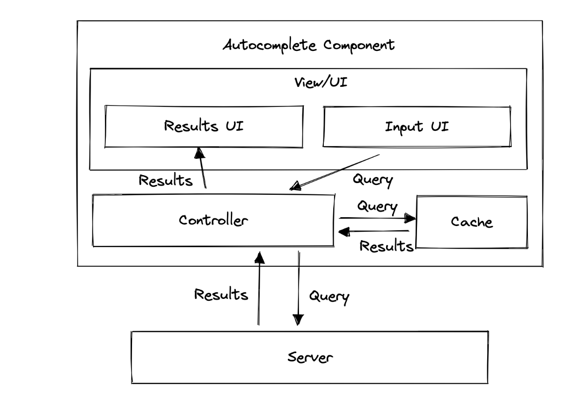

# Some Question You need to know

## Step1: Understand the problem establish design scop - Or I would like to call taking a communication of the design

- What specific features are we going to build
- How many users dose the produce have
- How fast does the company anticipate to scale up? What are the anticipated scales in 3 months, 6 months, and a year
- What is the company's technology stack? What existing services you might leverage to simplify the design

## Step2: Propose high-level design and get buy-in

## Step3: Design Deep dive

## Step4: Wrap Up

## Dos and Don't

### Dos

- Think you work with a colleague, He / She want to have a product, and you are the produce manager
- Ask for clarification, Do not assume your assumption is correct
- Understand the requirement of the problem
- There is neither the right answer nor the best answer, A solution design to solve the problems of a young startup is different from that of an established company with millions of users, Make sure you understand the requirements
- let the interviewer know what you are thinking, Communicate with your interview
- Suggest multiple approaches if possible
- Once you agree with your interviewer on the blueprint, go into details on each component. Design the most critical component first
- Bounce ideas off the interviewer, a good interviewer works with you as a teammate
- Never give up

### Don'ts

- Don't be unprepared for typical interview questions
- Don't jump into a solution without clarifying the requirements and assumptions
- Don't go into too much detail on a single component
- If you get stuck, don't hesitate to ask for hints
- Again, communicate, Don't think in silence
- Don't think your interview is done once you give the design, you are not done until your interviewer says your are done, ask for feedback early and often

# AutoComplete

Autocomplete is a common question asked by many companies and encompasses many useful front end concepts and techniques which can be generalized to other front end system design questions.

# Question

Design an autocomplete UI component that allows users to enter a search term into a text box, a list of search results appear in a popup and the user can select a result, just like Google's search bar

# Requirements Exploration (refine the requirement):

What kind of results should be supported?
What devices will this component be used on?
Do we need to support fuzzy search?

# Architecture

- Input field UI
  - handle user input and pass input to the controller
- Results UI
  - like a DropDown menu, receives result and presents them to the user
  - handles user selection and inform the controller selected input
- Cache
  - Stores the results for queries
- Controller
  - Interact act will all components
  - Passes user input and result between components

# Data Model

- Controller

  - props / options exposed via the component API

- Cache

# Interface definition

### Client

### Basic API

    Number of results
    API Url
    Event Listener
    Customized Rending

### Advanced API

    Minimum query length
    Debounce duration
    API timeout duration
    Cache-related

### Server API

# Optimizations and deep dive

### Network

### Cache

### Performance

### User Experience

### Accessibility
